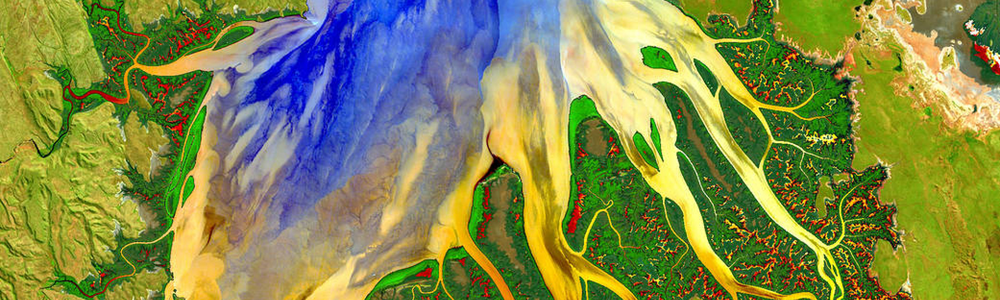

# Elsa Culler

Earth and environmental data science instructor for [Earthlab](https://earthlab.colorado.edu/) 
and [ESIIL](https://esiil.org/) in [Boulder, CO](https://www.bouldercoloradousa.com/).

I teach the Earth Data Analytics Professional Graduate Certificate Program at the [University of Colorado, Boulder Geography Department](https://www.colorado.edu/geography/). I also help out the the [ESIIL STARS](https://esiil.org/esiil-stars) undergraduate internship program for minority-serving institutions.

## Education:
  - B.S. Mechanical Engineering, [Franklin W. Olin College of Engineering](https://www.olin.edu/) (2012)
  - PhD Civil Engineering, [University of Colorado Boulder](https://www.colorado.edu/ceae/) (2021)
  
## Interests:
  - Hydrology
  - Cascading natural hazards
  - Education
  - Open Science
  
## Projects:
  - Coming soon!

## Publications
  - Culler, E. S., Badger, A. M., Minear, J. T., Tiampo, K. F., Zeigler, S. D., & Livneh, B. (2021). [A multi‐sensor evaluation of precipitation uncertainty for landslide‐triggering storm events](https://doi.org/10.1002/hyp.14260). Hydrological processes, 35(7), e14260.
