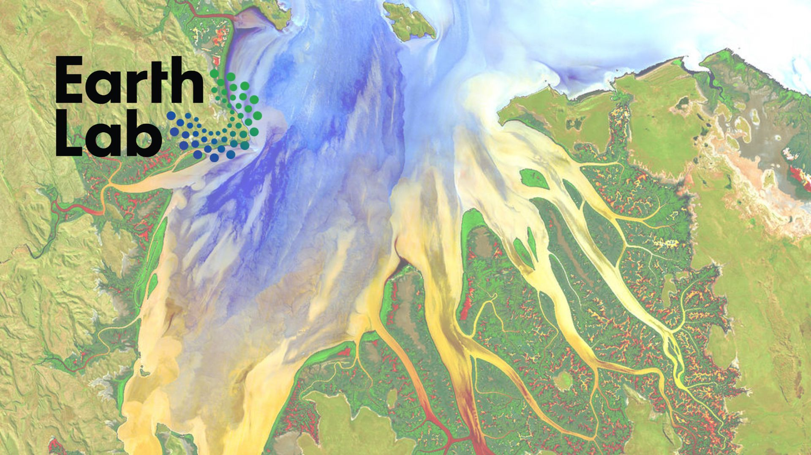

I teach the Earth Data Analytics Professional Graduate Certificate Program at the [University of Colorado, Boulder Geography Department](https://www.colorado.edu/geography/). I also help out the the [ESIIL STARS](https://esiil.org/esiil-stars) undergraduate internship program for faculty and students at minority-serving institutions.

## Textbooks
  - [ESIIL Stars Textbook](https://cu-esiil-edu.github.io/esiil-learning-portal/stars)
  - [ESIIL Data Short Course Textbook](https://cu-esiil-edu.github.io/esiil-learning-portal/shortcourse)

## Curriculum notebooks
  - [Midwestern Flooding](https://eculler.github.io/midwestern_flooding.html)
  - [Practice portfolio post](posts/portfolio_post.html)
