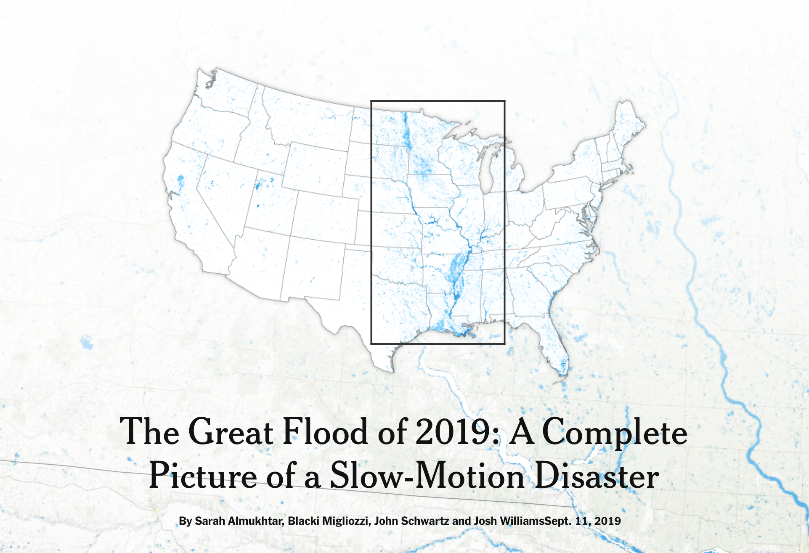
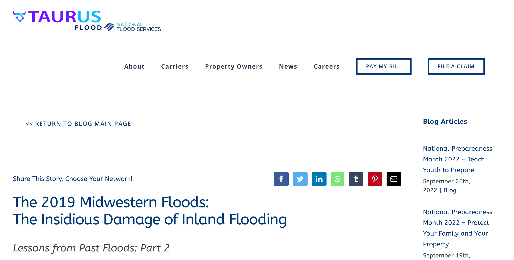
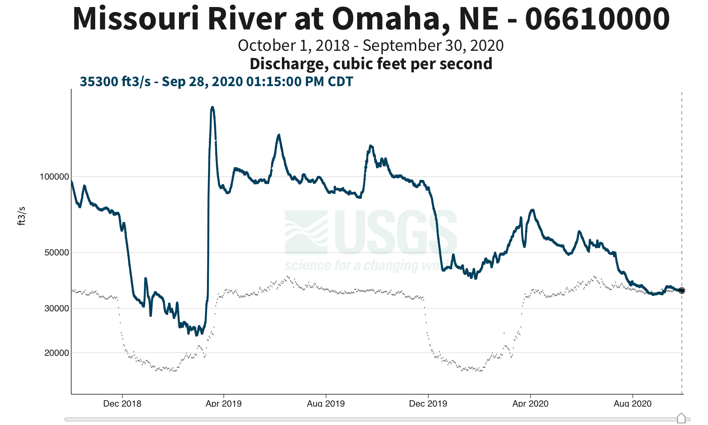
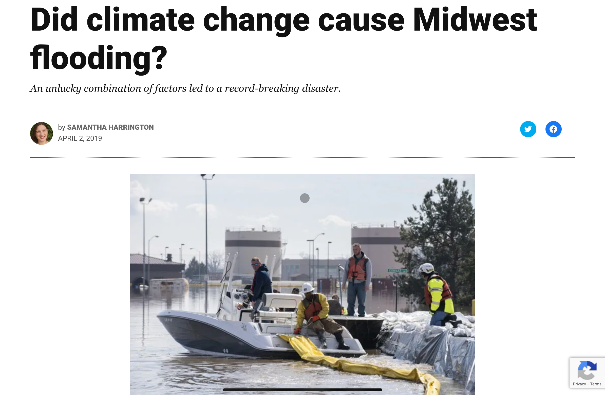
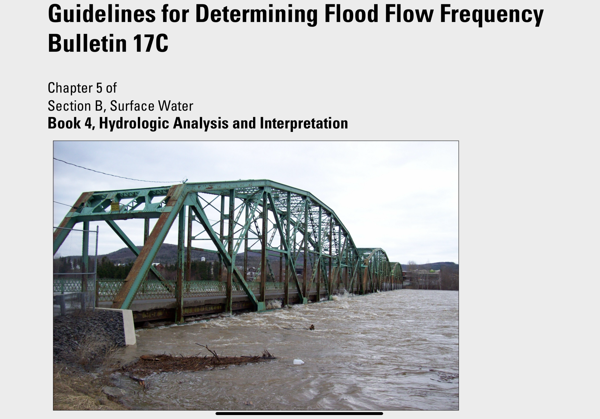

# In 2019, large swaths of the Midwestern United States were inundated by floods.

> Image source: <a src=https://www.npr.org/2019/03/21/705408364/nebraska-faces-over-1-3-billion-in-flood-losses target="_blank"> National Public Radio - Nebraska faces over 1.3 billion in flood losses.</a>"

---
---

## What impacts did the flooding have?

You can consider in the impacts of flooding across several domains, including:
  * Loss of life
  * Financial loss
  * Infrastructure damage
  * Ecosystem disturbance

Questions:
  * Can you think of any other types of impacts these floods might have had? 
  * Pick two types of impacts. What kind of data would you need to evaluate the extent of the impact?

---

### Have you or anyone you know experienced a flood?

What was that like? What kinds of human impacts did it have? Do you have any photographs?

---

### Interactive Reporting from the New York Times highlights the impacts of the flooding across the region

> Source: [The New York Times](https://www.nytimes.com/interactive/2019/09/11/us/midwest-flooding.html)

Questions:
* What types of impacts did these floods have on the region's people, agriculture, and infrastructure?
* Do you notice any issues of equity highlighted in this article? What is an example of a policy measure that could help to mitigate inequity in flood impacts and risk?
* What data did the New York Times use to create their images? Include a citation as if you had used these data yourself.
* What are the advantages and disadvantages of the data analysis and visualization in this article for conveying the effects of inland flooding?

---

### Compare the Missouri River before and during flooding at NASA Earth Observatory

> Source: [NASA Earth Observatory](https://earthobservatory.nasa.gov/images/144691/historic-floods-inundate-nebraska)

Questions:
  * Describe the satellite images in this article, as if for alt-text or a screen reader.
  * Did you learn anything new about the floods in the Earth Observatory images and article?
  * What data did NASA use to generate these images? Include a citation as though you were using the data yourself.
  * What are some advantages and disadvantages of the data source used by NASA for this purpose?

---

### Who else has skin in the game? National Flood Service's take

Check out this article about the Midwestern 2019 floods from an insurance company, National Flood Services.

Questions:
  * How can you tell that this article is from an insurance company instead of journalists or scientists?
  * Did you learn anything additional from this article that was not present in the other articles?
  * Do you trust this source? Are there parts of the article you trust more than others?
  * Obviously there's a potential for bias in this article. What biases might be present in other types of articles or data sources about these floods?

---

### In situ streamflow measurements in Omaha, NE were much higher than normal throughout 2019, but particularly in March

> Source: [USGS Water Data for the Nation - Monitoring Station on the Missouri River near Omaha, NE](https://waterdata.usgs.gov/monitoring-location/06610000/#parameterCode%253D00065%2526showMedian%253Dtrue%2526startDT%253D2018-10-01%2526endDT%253D2020-09-30)

Questions:
  * Compare and contrast this in situ information with the remotely sensed images. What are some advantages and disadvantages to these data?
  * How can we tell if this level of flooding is "abnormal"?

---
---

## What caused the 2019 Midwestern Floods?

Questions:
  * Did you learn anything about the causes of the flooding in the previous articles?
  * What is the difference between proximate and ultimate causation? How does the use of one or the other change the story about this flood?

---

### Consider the difference between susceptibility, hazard, and risk

**Susceptibility:** what aspects of a location make it more vulnerable to flooding when a triggering event like a large storm occurs?
**Hazard:** what is the likelihood that a natural disaster will occur? (susceptibility + trigger)
**Risk:** what is the likelyhood that a particular level of damage will occur? (susceptibility + trigger + people and infrastructure in the way)

Read this [article about guidelines for evaluating susceptibility, hazard, and risk](https://www.sciencedirect.com/science/article/pii/S0013795208001762)

Questions:
  * What are some ways that risk can be mitigated even if we are unable to reduce susceptibilty or hazard of flood events?

---

### Climate change is increasing flood hazards, but did it contribute to these floods?

> Source: [Yale Climate Connections](https://yaleclimateconnections.org/2019/04/did-climate-change-cause-midwest-flooding/)

Questions:
  * What are some ways that we as scientists can evaluate the contribution of climate change to a particular event?

---

### How does the U.S. Government evaluate flood risk?

> Source: [The US Geological Survey - Bulletin 17C](https://pubs.usgs.gov/tm/04/b05/tm4b5.pdf)

Questions:
  * What are some methods that the USGS uses to account for limited temporal extent of streamflow data?
  * Bulletin 17C assumes stationarity of flood flow. Explain, and discuss the advantages and disadvantages of this approach. More info:
    * [Stationarity is dead](https://www.science.org/doi/10.1126/science.1151915)
    * [Stationarity is undead](https://www.sciencedirect.com/science/article/pii/S0309170815000020)
